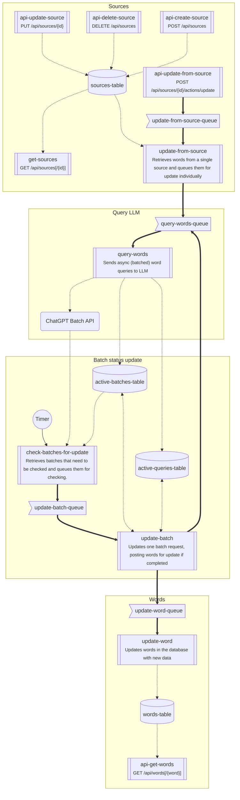
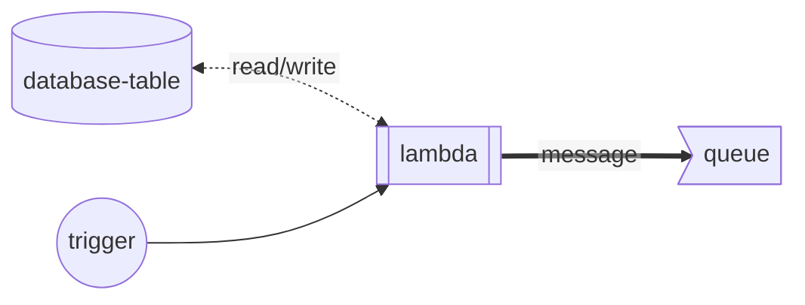

# Archiecture

```mermaid
%%{init: {"flowchart": {"htmlLabels": false}} }%%
graph TD;
    subgraph Sources
        sourcesTable -..-> getSources[["get-sources<br /><small>GET /api/sources[/{id}]</small>"]]
        apiUpdateSource[["api-update-source<br /><small>PUT /api/sources/{id}</small>"]] -..-> sourcesTable
        apiDeleteSource[["api-delete-source<br /><small>DELETE /api/sources</small>"]] -..-> sourcesTable
        apiCreateSource[["api-create-source<br /><small>POST /api/sources</small>"]] -..-> sourcesTable
        apiUpdateFromSource[["api-update-from-source<br /><small>POST /api/sources/{id}/actions/update</small>"]] ==> updateFromSourceQueue
        sourcesTable[("sources-table")] -..-> updateFromSource[["update-from-source<br/><small>Retrieves words from a single source and queues them for update individually</small>"]]
        updateFromSourceQueue>"update-from-source-queue"] ==> updateFromSource
    end
    subgraph Query LLM
        updateFromSource ==> queryWordsQueue>"query-words-queue"]
        queryWordsQueue ==> queryWords[["query-words<br /><small>Sends async (batched) word queries to LLM</small>"]]
        queryWords -..-> chatGPT(ChatGPT Batch API)
    end
    queryWords -...-> activeBatchesTable
    queryWords -..-> activeQueriesTable[("active-queries-table")]
    updateBatch ===> queryWordsQueue
    subgraph Batch status update
        timeTrigger@{ shape: circle, label: "Timer" } --> checkBatchesForUpdate
        checkBatchesForUpdate[["check-batches-for-update<br/><small>Retrieves batches that need to be checked and queues them for checking.</small>"]]
        checkBatchesForUpdate ==> updateBatchQueue
        updateBatchQueue>"update-batch-queue"] ==> updateBatch
        activeBatchesTable[("active-batches-table")] ..-> checkBatchesForUpdate
        activeBatchesTable <-..-> updateBatch
        activeQueriesTable <-..-> updateBatch[["update-batch<br/><small>Updates one batch request, posting words for update if completed</small>"]]
    end
    subgraph Words
        updateBatch ==> updateWordQueue
        updateWordQueue>"update-word-queue"] ==> updateWord
        updateWord[["update-word<br /><small>Updates words in the database with new data</small>"]]        
        updateWord ..-> wordsTable[("words-table")]
        wordsTable ..-> apiGetWords[["api-get-words<br /><small>GET /api/words[/{word}]</small>"]]
    end
    chatGPT .-> checkBatchesForUpdate
```

## Legend

```mermaid
%%{init: {"flowchart": {"htmlLabels": false}} }%%
graph LR;
    database[("database-table")]
        <-."read/write".->
    lambda[["lambda"]] =="message"==> queue>"queue"]
    trigger@{ shape: "circle" } --> lambda
```