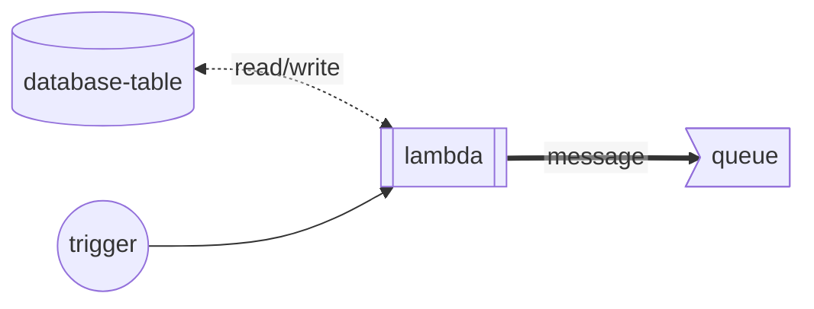

# Architecture

```mermaid
%%{init: {"flowchart": {"htmlLabels": false}} }%%
graph TD;
    subgraph Backend word updates
    subgraph Update from source
    sourcesTable[("sources-table")] -..-> updateFromSource[["update-from-source<br/><small>Retrieves words from a single source and queues them for update individually</small>"]]
    externalTrigger@{ shape: circle, label: "HTTP" } --> updateFromSource
    updateFromSourceQueue>"update-from-source-queue"] ==> updateFromSource
    end
    subgraph Query LLM
    updateFromSource ==> queryWordQueue>"query-word-queue"]
    queryWordQueue ==> queryWord[["query-word<br /><small>Sends async (batched) word queries to LLM</small>"]]
    end
    queryWord -..-> chatGPT(LLM Batch API)
    queryWord -..-> activeQueriesTable[("active-queries-table")]
    updateBatchStatus ==> queryWordQueue
    subgraph Batch status update
    timeTrigger@{ shape: circle, label: "Timer" } --> updateBatches
    updateBatches[["update-batches<br/><small>Retrieves batches that need to be checked and queues them for checking.</small>"]]
    updateBatches ==> updateBatchStatusQueue
    updateBatchStatusQueue>"update-batch-status-queue"] ==> updateBatchStatus
    activeQueriesTable ..-> updateBatches
    activeQueriesTable <-..-> updateBatchStatus[["update-batch-status<br/><small>Updates one batch request, posting words for update if completed</small>"]]
    updateBatchStatus ..-> completedQueriesTable[("completed-queries-table")]
    end
    subgraph Update words
    updateBatchStatus ==> updateWordQueue
    updateWordQueue>"update-word-queue"] ==> updateWord
    updateWord[["update-word<br /><small>Updates words in the database with new data</small>"]]
    updateWord ..-> wordsTable[("words-table")]
    end
    chatGPT .-> updateBatches
    end
```

## Legend

```mermaid
%%{init: {"flowchart": {"htmlLabels": false}} }%%
graph LR;
    database[("database-table")]
        <-."read/write".->
    lambda[["lambda"]] =="message"==> queue>"queue"]
    trigger@{ shape: "circle" } --> lambda
```